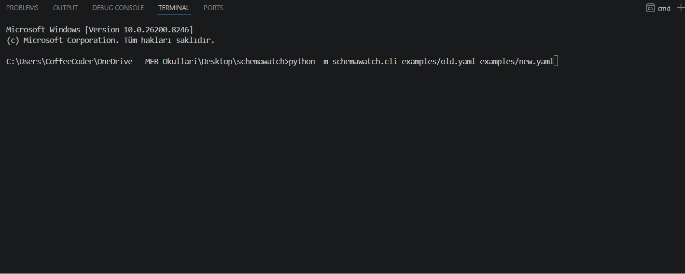

# SchemaWatch

> Detect breaking API changes before they reach production.
> Works with any OpenAPI file — just run one command.


---

## 🎬 Demo


````bash
python -m schemawatch.cli examples/old.yaml examples/new.yaml
````

🚀 What is SchemaWatch?

SchemaWatch compares two OpenAPI schemas and detects breaking API changes automatically.

It is designed to be:

⚡ Simple
⚡ Fast
⚡ CI/CD friendly

🚀 Features

SchemaWatch detects:

Removed endpoints
Removed HTTP methods
Removed schemas
Removed response fields
Field type changes
Fields that became required

📦 Installation
pip install schemawatch

⚙️ Usage
schemawatch old.yaml new.yaml
Save to file
schemawatch old.yaml new.yaml --format json --output result.json
## 🧑‍💻 Real-world usage

Use SchemaWatch with your own OpenAPI files:

```bash
schemawatch openapi_old.yaml openapi.yaml
schemawatch api/v1/openapi.yaml api/v2/openapi.yaml

🧪 Example Output
🚨 SchemaWatch Report

⚠ Breaking changes detected: 5

- Method removed: GET /users
- Endpoint removed: /orders
- Response field removed: User.email
- Field type changed: User.id integer -> string
- Field became required: User.id

🔁 CI/CD Integration
SchemaWatch is designed to run in CI pipelines.
schemawatch openapi_old.yaml openapi.yaml

Exit code 1 → breaking changes detected ❌
Exit code 0 → no breaking changes ✅

💬 PR Comment Integration
Automatically comments on pull requests:
⚠ Breaking API changes detected:
- Method removed: GET /users
- Field type changed: User.id integer -> string

🤔 Why not oasdiff / openapi-diff?

There are great tools like oasdiff and openapi-diff.

SchemaWatch focuses on simplicity and CI-first workflows.
| Feature        | SchemaWatch        | oasdiff / openapi-diff |
| -------------- | ------------------ | ---------------------- |
| Easy CLI       | ✅ Very simple      | ⚠️ More complex        |
| CI/CD friendly | ✅ Built-in mindset | ⚠️ Needs config        |
| PR comments    | ✅ Yes              | ❌ Not built-in         |
| Output         | ✅ Clean & readable | ⚠️ Verbose             |
| Setup time     | ⚡ 10 seconds       | ⏱️ Longer              |

👉 SchemaWatch = quick setup + practical usage

```md
## ⚙️ GitHub Actions Example

```yaml
- name: Check API breaking changes
  run: schemawatch openapi_old.yaml openapi.yaml

🛠 Roadmap
Request body change detection
Response status code comparison
Enum change detection
Nested object comparison improvements
Markdown / HTML output

🤝 Contributing

Contributions are welcome!

Fork the repository
Create a feature branch
Commit your changes
Open a pull request

📄 License

## 📄 License

This project is licensed under the MIT License.

